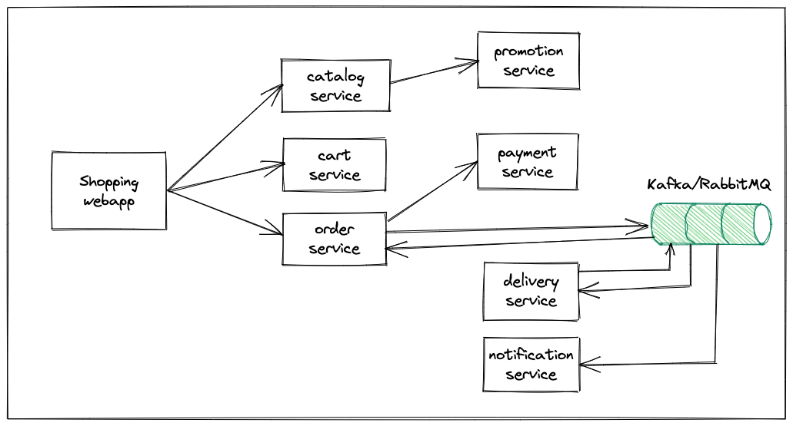

# BookStore
BookStore is an online shopping application selling books.

## Goal
The main goal of building this application is to learn various technologies by building a reasonably complex application.

## Technical Architecture
The key components of BookStore application are:
* bookstore-webapp: This is the customer facing web application where they can browse through available books, add books to cart and place an order.
* bookstore-backoffice: This is a backoffice web application used by administrators and staff to setup the books catalog and manage orders.
* backing-services: These are domain-oriented backend services that fulfill the needs for bookstore-webapp and bookstore-backoffice.

We would like to build the backing-services as independently deployable microservices so that each service can be developed in the preferred language/framework.
Most of these backing-services will expose REST APIs to be consumed by webapp, backoffice and also by other APIs. 
Some backing-services could be only event processors where they consume events from an event store(Kafka, RabbitMQ etc), process them and optionally publish other events.

The web applications bookstore-webapp, bookstore-backoffice could be implemented using SPA frameworks like Angular, VueJS, ReactJS etc 
or using server-side rendering technologies like Thymeleaf.

## Typical application flow
A typical application usage flow looks like:
* Customer browse through product catalog
* Add preferred products to cart
* Go to checkout page
* Enter customer details, delivery address, payment details.
* Place order
  * Validate order details
  * Validate Payment details
  * If payment details is valid then set status to "NEW" otherwise to "ERROR"
  * Save order details in DB
  * Publish OrderCreated Event
  * If payment details is invalid then Publish OrderError Event
* Order Processing
  * Notification-service receives OrderCreated Event and send an email notification to customer
  * Notification-service receives OrderError Event and send an email notification to customer
  * Delivery-service receives OrderCreated Event and update local status to SHIPPING and then publish OrderShipping Event
  * Order-service receives OrderShipping Event and update status to SHIPPING
  * Notification-service receives OrderShipping Event and send an email notification to customer
  * Delivery-service DeliveryJob update local status to DELIVERED and then publish OrderDelivered Event
  * Order-service receives OrderDelivered Event and update status to DELIVERED
  * Notification-service receives OrderDelivered Event and send an email notification to customer
* Customer receives order update emails with a link to view current order details.

### Backend Services

#### 1. catalog-service
This service manages the books catalog and exposes the following REST API endpoints:
* Get books by page
* Get book by ISBN
* Create new Book
* Update existing book
* Delete a book
* Search books by title or description

While serving product information this service calls promotion-services and include discount if exists.

For more info see [Catalog Service Docs](catalog-service.md)

#### 2. promotion-service
This service manages promotions(discounts) for books and exposes the following REST API endpoints:
* Get promotions for a given set of ISBNs
* Get promotion for a given ISBN
* Create promotion for a given book
* Update promotion for a given book
* Delete promotion for a given book

For more info see [Promotion Service Docs](promotion-service.md)

#### 3. order-service
This service manages customer orders and exposes the following REST API endpoints:
* Create an order. After successfully saving order info publish ORDER_CREATED event.
* Cancel order. After cancelling order publish ORDER_CANCELLED event.
* Get all orders
* Get order by order_number

Event Handlers:
* ORDER_SHIPPING event handler: Update order status to SHIPPING
* ORDER_DELIVERED event handler: Update order status to DELIVERED
* ORDER_ERROR event handler: Update order status to ERROR

For more info see [Order Service Docs](order-service.md)

#### 4. payment-service
This services exposes API to validate payment info (credit card number, cvv, expiry month/year)

For more info see [Payment Service Docs](payment-service.md)

#### 5. delivery-service
This service manages order delivery process.

Event Handlers:
* ORDER_CREATED event handler: Starts processing order shipment and publish ORDER_SHIPPING event

Jobs:
* OrderDeliveryJob:
  * Process orders with status=SHIPPING, deliver the order and publish ORDER_DELIVERED event. 
  * In case of any failures publish ORDER_ERROR event.

For more info see [Delivery Service Docs](delivery-service.md)

#### 6. notification-service
This service send email notifications on various order events.

Event Handlers:
* ORDER_CREATED event handler: Send order received email notification
* ORDER_SHIPPING event handler: Send order shipping started email notification
* ORDER_DELIVERED event handler: Send order delivered email notification
* ORDER_ERROR event handler: Send order can't be fulfilled email notification

For more info see [Notification Service Docs](notification-service.md)

#### 7. API Gateway
Instead of exposing individual APIs directly, the API Gateway will serve as a facade to all the REST APIs.

## How to contribute?
* Run the application and let us know if you face any issue
* Contribute implementation of a service in your favourite language/framework